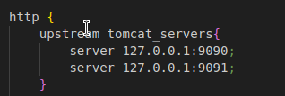
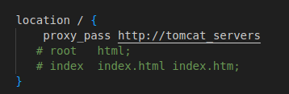

<h1>Blue-Green Deployment for pet clinic java application server configrations and operations</h1>
<h2>Through Ansible Directory responsible for most of the server configrations and operations is done</h2>
<h3>Defined in the directory the installation and the configration of:</h3>
<li>Tomcat</li>
<li>Nagios</li>
<li>Jenkins</li>
<h3>Each component installation is done in a separate role and then executed all roles in the configration playbook (InstallationPlaybook.yaml). Specific configrations is conducted on tomcat to make it operatable on port 9090 and to set up admin credentials (ConfigTomcatPlaybook.yml)</h3>
<h3>Defined in the inventory file the server that will be managed by ansible</h3>
<h2>nginx is installed and used as load balancer between in the deployment for smooth deployment</h2>
<h3>Steps of nginx installation configrations of nginx through linux terminal:</h3>
<label>nginx dependencies installation</label>
<ol>sudo apt install build-essential libpcre3 libpcre3-dev zlib1g zlib1g-dev libssl-dev</ol>
<label>Download nginx:</label>
<ol>wget http://nginx.org/download/nginx-1.24.0.tar.gz</ol>
<label>Extract nginx tar file:</label>
<ol>tar -zxvf nginx-1.24.0.tar.gz</ol>
<label>Extract nginx tar file:</label>
<ol>tar -zxvf nginx-1.24.0.tar.gz</ol>
<label>change directory to extracted file:</label>
<ol>cd nginx-1.24.0</ol>
<label>Configure the build options:</label>
<ol>./configure</ol>
<label>Compile and install nginx:</label>
<ol>sudo make install</ol>
<label>start nginx:</label>
<ol>sudo /opt/nginx/sbin/nginx</ol>
<label>servers addition to nginx load balancer (nginx.conf modification):</label>
<ol></ol>
<ol></ol>
<label>restart nginx after applying modifications:</label>
<ol>sudo /opt/nginx/sbin/nginx -s reload</ol>
<h3>Build and Deployment is done through Jenkins pipeline</h3>
<h4>This pipeline is responsible for:</h4>
<li>Fetch for the updated git repository</li>
<li>Edit the pom.xml file in the java application to generate war file</li>
<li>Edit the main java class in the application to make it able to run on a server</li>
<li>Run the build command to build the application</li>
<li>Deploy the packed application to apache tomcat server</li>
<h3>Server monitoring is done through Nagios</h3>
<h4>The monitoring proccess is responsible for runinng sanity checks to monitor tomcat server which is done as follows :</h4>
<li>Define nagios service to monitor tomcat in tomcat.cfg</li>
<li>Execute playbook to save nagios service configrations and restart nagios (Monitor.yaml)</li>
